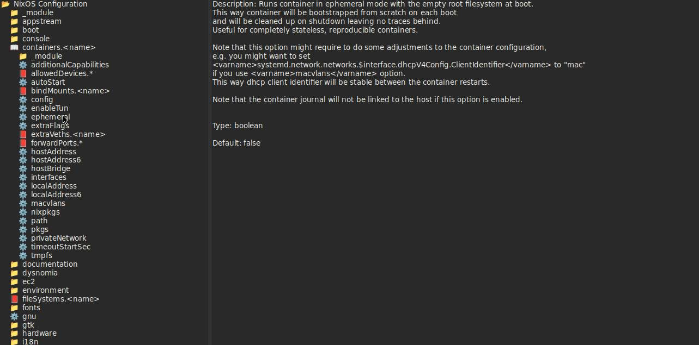
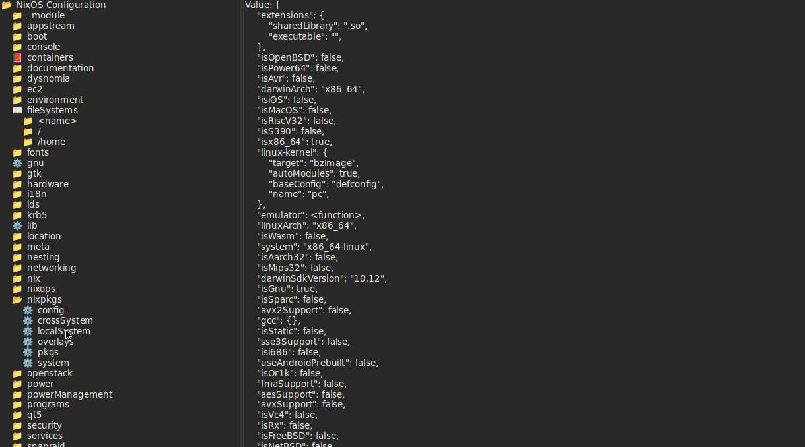
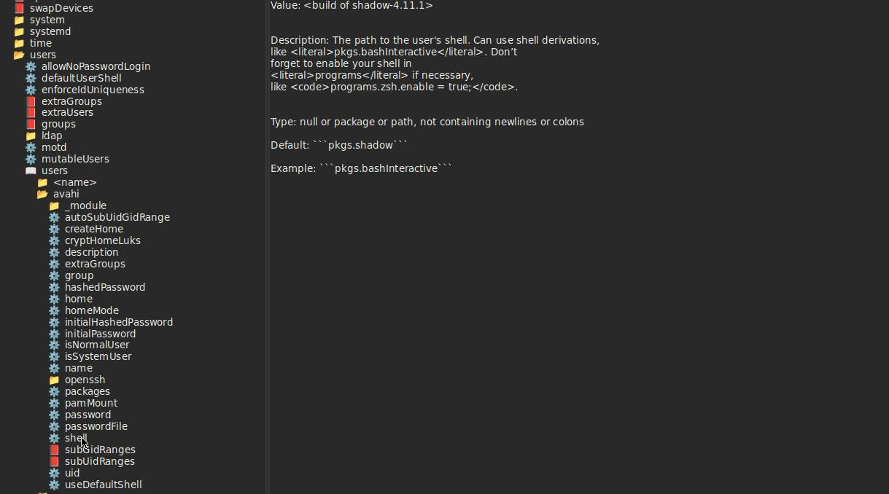

# nixos-druid
Highly experimental GUI for NixOS.
For now I expect to frequently make large changes and break stuff whenever I'm working on this.
Screenshots in this README may be out of date as well.

Currently consists of the binaries `nixos-option-browser` and `nixos-config-browser` for viewing documentation and configuration respectively.
A third binary for editing a JSON representation of the NixOS configuration is on my mind but would be a significant undertaking.
I plan to devote my attention to the other binaries first so this may remain a pipedream.

## nixos-option-browser
The most basic binary, allows viewing documentation akin to `man configuration.nix`.

The following screenshot shows the `nixos-option-browser` opened with the `containers.<name>.ephemeral` option focused:

## nixos-config-browser
This allows viewing the documentation like `nixos-option-browser` but now also shows the final configuration value like `nixos-option` and a `nix repl` with `(builtins.getFlake "/etc/nixos").nixosConfigurations.hostname.config` do.

Showing the value of `nixpkgs.localSystem`:

With the `users.users.avahi.shell` option selected:

